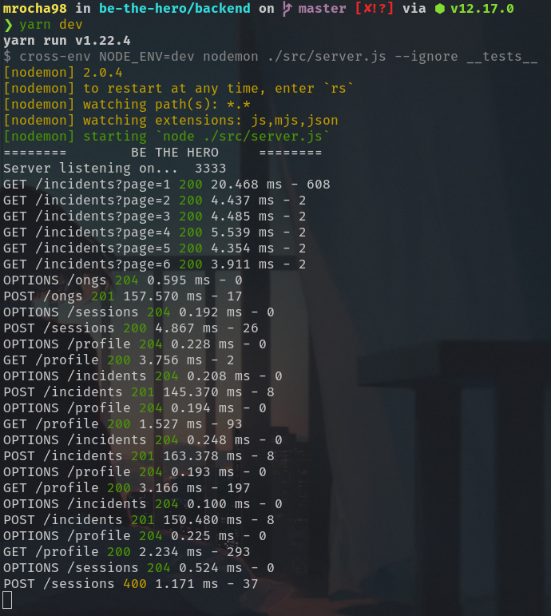
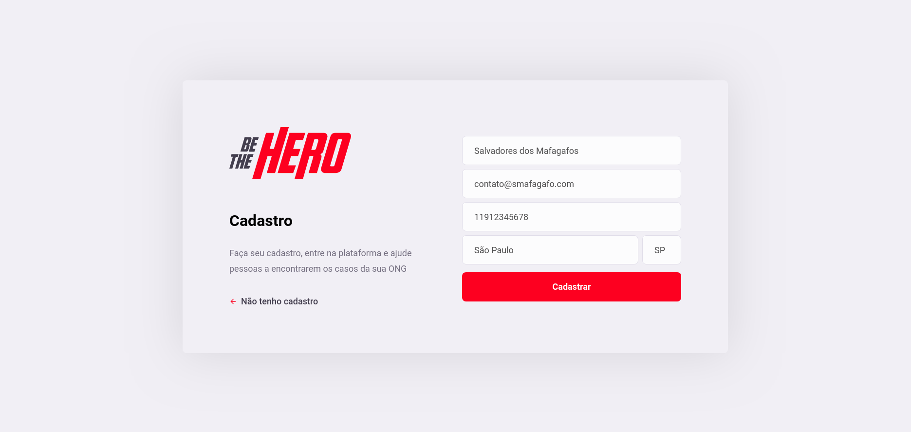
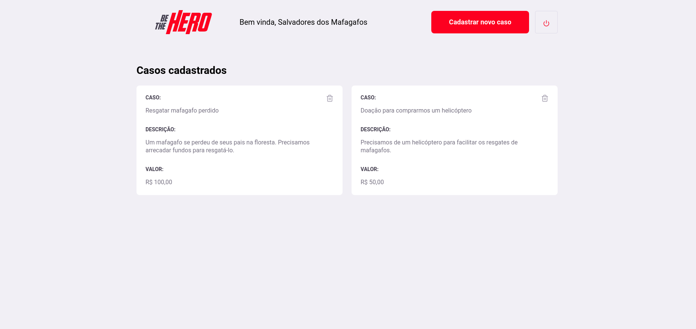
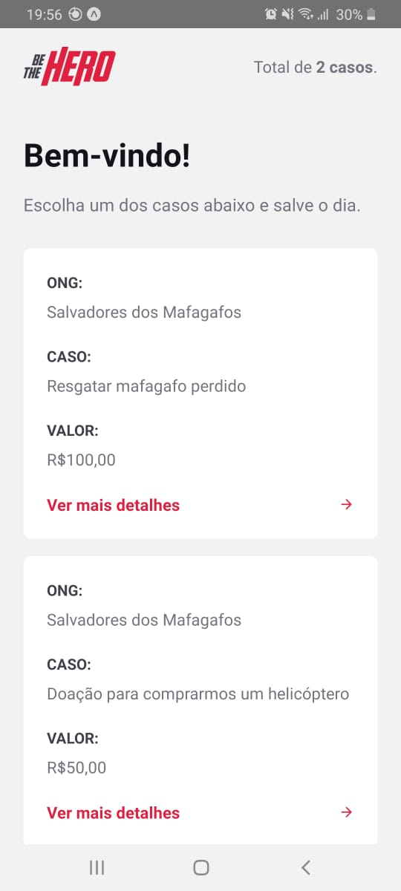
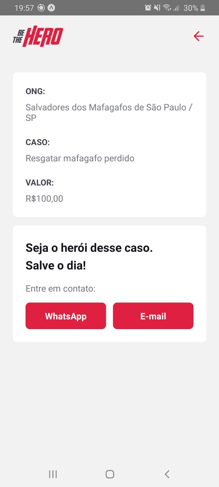
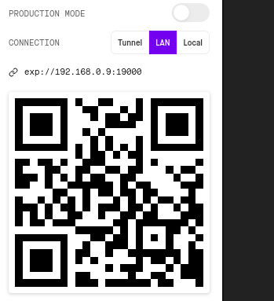

# Be The Hero - Backend


Projeto desenvolvido na [11° OmniStack](https://github.com/Rocketseat/semana-omnistack-faq) da [RocketSeat.](https://rocketseat.com.br/)

Seja o herói do dia ajudando ONGs!

## 🖥️ Capturas de tela

### Back-end



### Front-end




### Mobile




## ⚙️ Como executar

Eu utilizei o gerenciador de pacotes [yarn](https://yarnpkg.com/). Sinta-se livre para utilizar o NPM.

### Back-end

```bash
cd backend
yarn # instala dependências
yarn knex migrate:list # lê a lista de migration
yarn knex migrate:latest # executa as migrations
yarn dev # roda a aplicação em modo de desenvolvimento (usando nodemon)
```

### Front-end

```bash
cd frontend
yarn # instala dependências
yarn dev # roda a aplicação em modo de desenvolvimento
```

### Mobile

```bash
cd mobile
yarn # instala dependências
yarn start # abre uma nova aba com informações do Expo
```

Copie o IP que fica acima do QR Code e substitua no arquivo: `src/services/api.js`.



## 📜 Licença

Esse projeto foi desenvolvido sob a licença [MIT](https://github.com/mrocha98/be-the-hero/blob/master/license).
